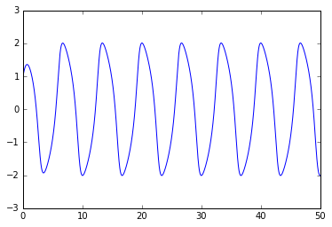
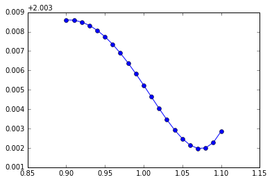
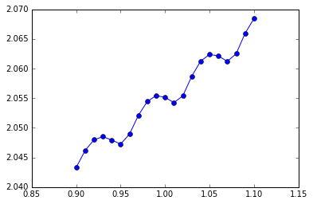
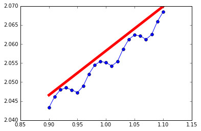

    def ddxdtt(x, dxdt, mu):
        return mu * (1 - x**2) * dxdt - x

    ddxdtt(1, 1, 1)

    -1

    def dudt(u, mu):
        x, dxdt = u
        dudt = array([dxdt, ddxdtt(x, dxdt, mu)])
        return dudt

    dudt([1,1], 1)

    array([ 1, -1])

    from scipy.integrate import odeint
    
    def run(u, mu, nsteps):
        x = empty(nsteps)
        for i in range(nsteps):
            u = odeint(lambda u,t : dudt(u, mu), u, [0, 0.01])[1]
            x[i] = u[0]
        return u, x

    u, x = run([1, 1], 1, 5000)

    %matplotlib inline
    plot(0.01 * arange(x.size), x)

    [<matplotlib.lines.Line2D at 0x7fa06a3cd190>]

    mu_array = linspace(0.9, 1.1, 21)
    x2_mean = empty(mu_array.size)
    for i, mu in enumerate(mu_array):
        _, x = run([1, 1], mu, 5000)
        x2_mean[i] = (x**2).mean()
    plot(mu_array, x2_mean, 'o-')

    [<matplotlib.lines.Line2D at 0x7fbbef019310>]

    mu_array = linspace(0.9, 1.1, 21)
    x2_mean = empty(mu_array.size)
    for i, mu in enumerate(mu_array):
        _, x = run([1, 1], mu, 50000)
        x2_mean[i] = (x**2).mean()
    plot(mu_array, x2_mean, 'o-')

    [<matplotlib.lines.Line2D at 0x7fa06a3cda50>]

    from fds import shadowing
    
    def run_x2(u0, mu, nsteps):
        u, x = run(u0, mu, nsteps)
        return u, x**2
    
    J, G = shadowing(run_x2, [1,1], 1, 1, 10, 500, 500)

    plot(mu_array, x2_mean, 'o-')
    plot([0.9, 1.1], [J-0.1*G, J+0.1*G], '-r', lw=5)

    [<matplotlib.lines.Line2D at 0x7fa06812f050>]

